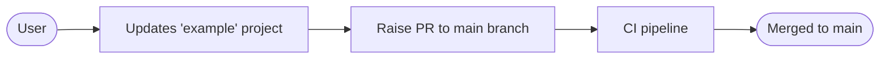

# template project for hexagonal-spring-boot-kotlin

This is a template project for hexagonal-spring-boot-java. This project is generated using [copier](https://copier.readthedocs.io/en/stable/) .

## Pre-requisites

- [copier](https://copier.readthedocs.io/en/stable/#installation)
- Jdk 21
- Maven >3.9.5

## How to contribute ?

### example

This directory contains the maven hexagonal-spring-boot-kotlin template project. This will be used to generate template project for copier. This project is used for the contributors to make their changes and test it locally.

Following are the keywords reserved for the template project and their equivalent replacements in {{app_name}} project:

| Keyword      | Replacement                   |
|--------------|-------------------------------|
| Examples     | {{domain_plural_capitalized}} |
| examples     | {{domain_plural}}             |
| Example      | {{domain_capitalized}}        |
| example      | {{domain}}                    |
| packagename  | {{package_name}}              |
| artifactName | {{artifact_id}}               |
| group-id     | {{group_id}}                  |
| EXAMPLES     | {{domain_plural_uppercase}}   |
| EXAMPLE      | {{domain_uppercase}}          |

Refer script [generate-copier-template-from-example-project.sh](generate-copier-template-from-example-project.sh) which is used to generate the copier template project. This script is also being used by [`.github/workflows/ci.yaml`](.github/workflows/ci.yaml) pipeline too.

### {{app_name}}

> NOTE: DO NOT MODIFY THIS DIRECTORY DIRECTLY

This directory contains the generated project from `example` project. The project is generated using the script [generate-cookiecutter-template-from-example-project.sh](generate-copier-template-from-example-project.sh) which is used to generate the copier template project.
